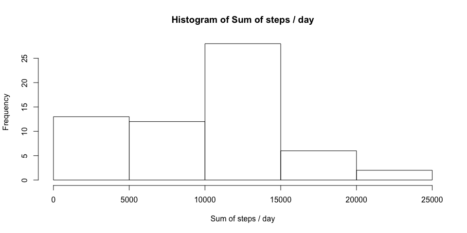

# Reproducible Research: Peer Assessment 1

## Loading and preprocessing the data
1. Load the data

```r
activity <- read.csv("activity.csv", colClasses = c("numeric", "Date", "numeric"))
```
2. No preprocessing required because we used colClasses

## What is mean total number of steps taken per day?
1. Calculate the total number of steps taken per day

```r
stepsPerDay <- aggregate(activity$steps, by = list(activity$date), FUN = sum, na.rm = TRUE)
colnames(stepsPerDay) <- c("date", "sum")
```
2. Make a histogram of the total number of steps taken each day

```r
hist(stepsPerDay$sum, main = "Histogram of Sum of steps / day", xlab = "Sum of steps / day")
```

 
3. Calculate and report the mean and median of the total number of steps taken per day

```r
mean(stepsPerDay$sum, na.rm = TRUE)
```

```
## [1] 9354.23
```

```r
median(stepsPerDay$sum, na.rm = TRUE)
```

```
## [1] 10395
```

## What is the average daily activity pattern?
1. Make a time series plot (i.e. type = "l") of the 5-minute interval (x-axis) and the average number of steps taken, averaged across all days (y-axis)

```r
stepsPerInterval <- aggregate(activity$steps, by = list(activity$interval), FUN = mean, na.rm = TRUE)
colnames(stepsPerInterval) <- c("interval", "mean")
plot(stepsPerInterval, type = "l", main = "Average Number of Steps Taken Across All Days")
```

 

2. Which 5-minute interval, on average across all the days in the dataset, contains the maximum number of steps?

```r
stepsPerInterval[stepsPerInterval$mean == max(stepsPerInterval$mean),]$interval
```

```
## [1] 835
```


## Inputing missing values
1. Calculate and report the total number of missing values in the dataset

```r
nrow(activity[is.na(activity$steps), ])
```

```
## [1] 2304
```

2. Devise a strategy for filling in all of the missing values in the dataset. The strategy does not need to be sophisticated. For example, you could use the mean/median for that day, or the mean for that 5-minute interval, etc.

```r
activity2 <- merge(activity, stepsPerInterval, by = "interval")
```

3. Create a new dataset that is equal to the original dataset but with the missing data filled in.

```r
activity2$steps <- ifelse(is.na(activity2$steps), activity2$mean, activity2$steps)
activity2 <- activity2[, colnames(activity)]
```

4. Make a histogram of the total number of steps taken each day and Calculate and report the mean and median total number of steps taken per day. 

```r
stepsPerDay2 <- aggregate(activity2$steps, by = list(activity2$date), FUN = sum, na.rm = TRUE)
colnames(stepsPerDay2) <- c("date", "sum")

hist(stepsPerDay2$sum, main = "Histogram of Sum of steps / day", xlab = "Sum of steps / day")
```

 
Do these values differ from the estimates from the first part of the assignment? 

<blockquote>Yes</blockquote>

What is the impact of imputing missing data on the estimates of the total daily number of steps?

<blockquote>New histogram has become more bellshaped</blockquote>

## Are there differences in activity patterns between weekdays and weekends?
1. Create a new factor variable in the dataset with two levels – “weekday” and “weekend” indicating whether a given date is a weekday or weekend day.

```r
activity2$weekdaytype <-  as.factor(ifelse(weekdays(activity2$date) %in% c("Saturday", "Sunday"), "Weekend", "Weekday"))
```

2. Make a panel plot containing a time series plot (i.e. type = "l") of the 5-minute interval (x-axis) and the average number of steps taken, averaged across all weekday days or weekend days (y-axis).

```r
stepsPerInterval2 <- aggregate(activity2$steps, by = list(activity2$interval, activity2$weekdaytype), FUN = mean, na.rm = TRUE)
colnames(stepsPerInterval2) <- c("interval", "weekdaytype", "mean")

library(lattice)
xyplot(mean ~ interval | weekdaytype, stepsPerInterval2, type = "l", layout = c(1,2), main = "Average Number of Steps")
```

 
